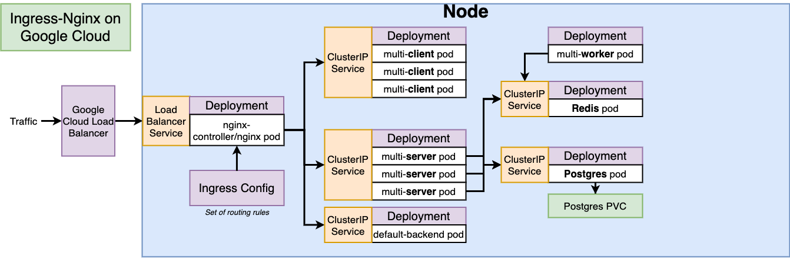

# K8S Fibo
A k8s example



## Imperative Commands

Generate secret (e.g. for postgres password)
```
$ kubectl create secret generic pgpassword --from-literal PGPASSWORD=<the-password>
```

## Production Deployment Manual Steps (GCP)

Go to GCP, GKE, enable billing, create a cluster

Go to GCP IAM, create a service account for Travis CI
- download the json file for key
- on local machine, encrypt it, then use Travis CI cli to link this file to the repository
    - $ docker run -it -v $(pwd):/app ruby:2.4 sh
    - \# gem install travis
    - \# travis login
    - \# travis encrypt-file <the-key-filename>.json -r ng-kode/k8s-fibo
- Copy-paste the **encrypted** file (<the-key-filename>.json.enc) to the project root
- Add the decrypt json file command to travis.yml, for example `openssl aes-256-cbc -K $encrypted_d5468fb2d2b8_key -iv $encrypted_d5468fb2d2b8_iv -in k8s-fibo-298602-554d7dba65d1.json.enc -out k8s-fibo-298602-554d7dba65d1.json -d`

Go to Travis CI, find the repository, go to settings, add the following environment variables:
DOCKER_USERNAME, DOCKER_PASSWORD

Go to GCP, open console, point gcloud to the project and zone and cluster
```
$ gcloud config set project k8s-fibo-298602
$ gcloud config set compute/zone asia-east2-a
$ gcloud container clusters get-credentials k8s-fibo
```
- Create k8s secret
    ```
    $ kubectl create secret generic pgpassword --from-literal PGPASSWORD=<the-password>
    ```
- <a href="https://helm.sh/docs/intro/install/#from-script" target="_blank">Install helm</a> (3rd-party plugin manager for a k8s cluster)
    ```
    $ curl -fsSL -o get_helm.sh https://raw.githubusercontent.com/helm/helm/master/scripts/get-helm-3
    $ chmod 700 get_helm.sh
    $ ./get_helm.sh
    ```
- <a href="https://kubernetes.github.io/ingress-nginx/deploy/#using-helm" target="_blank">Use helm to install ingress-nginx</a>
    ```
    $ helm repo add ingress-nginx https://kubernetes.github.io/ingress-nginx
    $ helm repo update
    $ helm install my-release ingress-nginx/ingress-nginx
    ```
    - Go to GKE, Services & Ingress, check if my-release-ingress-nginx-controller exists
